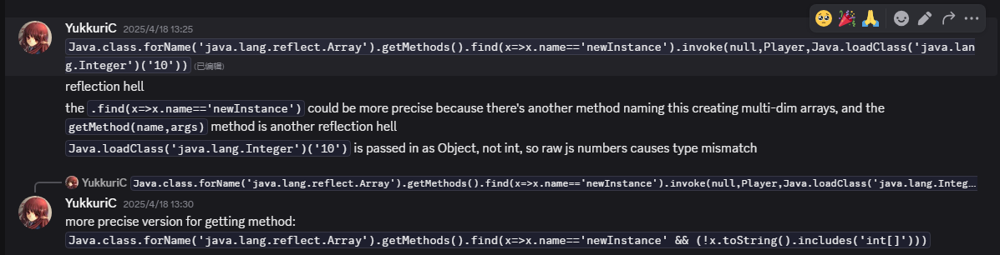

# 用原版的自带多方快API检测多方快
## 介绍
用原版的多方快API好处是可以减小整合包的体积（或许），以及不需要做繁杂的注册处理，但是，由于`ojang`的屎山导致可能存在一些小bug，如[末地传送门框架的范围错误多判定问题](https://www.bilibili.com/video/BV17LNoeZEwd)，所以还是推荐使用第三方API

## in server_script
```javascript
const $BlockInWorld = Java.loadClass("net.minecraft.world.level.block.state.pattern.BlockInWorld");
const $BlockStatePredicate = Java.loadClass("net.minecraft.world.level.block.state.predicate.BlockStatePredicate");
const $BlockPatternBuilder = Java.loadClass("net.minecraft.world.level.block.state.pattern.BlockPatternBuilder");

/**
* Create a block pattern builder.
* @param {string[][]} pattern
* @param {Object.<string, Special.Block | Special.BlockTag>} blocks
* @returns {Internal.BlockPattern_}
*/
function blockPatternBuider(pattern, blocks) {
    let builder = $BlockPatternBuilder.start();

    pattern.forEach(row => {
        builder.aisle.apply(builder, row)
    })

    Object.entries(blocks).forEach(([name, block]) => {
        let callback = null;
        if (block.startsWith('#')) {
            callback = $BlockInWorld.hasState(start => isBlockStateInTag(
                start,
                block.slice(1)
            ))
        } else {
            callback = $BlockInWorld.hasState(start => {
                return start.block.id === block
            })
        }
        builder.where(name, callback)
    })
    builder.where("?", $BlockInWorld.hasState($BlockStatePredicate.ANY))
    builder.where("!", $BlockInWorld.hasState(start => !start.isAir()))
    return builder.build();
}


// const dict = {
//     G: "minecraft:gold_block",
//     C: '#forge:cobblestone',
//     B: "minecraft:beacon"
// }
// const HerobrinePyramidsStyleA2 = blockPatternBuider(
//     [
//         [" C ", "CCC", " C "],
//         ["C C", " B ", "C C"],
//         ["GCG", "CCC", "GCG"],
//     ],
//     dict
// );
const dict = {
    F: "minecraft:fire",
    N: "minecraft:netherrack",
    C: "minecraft:crying_obsidian",
    G: '#minecraft:stone_bricks'
}
const HerobrinePyramidsStyleA2 = blockPatternBuider(
    [
        ["F"],
        ["N"],
        ["C"],
        ["G"],
        ["G"]
    ],
    dict
);

BlockEvents.rightClicked((e) => {
    const { block, player, level } = e;
    if (
        !["minecraft:beacon", "minecraft:crying_obsidian"].includes(block.id)
    ) return;
    let p = HerobrinePyramidsStyleA2.find(
        level, block.pos
    );
    if (p !== null) { // 这里最好用!==
        if (posInAABB(
            block.pos,
            p
        )) {
            player.tell("✅ match success at id:" + block.id)
        } else {
            player.tell("❌ match failed at id:" + block.id)
        }

    } else {
        player.tell("❌ match failed at id:" + block.id)
    }
})


const $Registries = Java.loadClass("net.minecraft.core.registries.Registries");
const $TagKey = Java.loadClass("net.minecraft.tags.TagKey");
const $BlockState = Java.loadClass("net.minecraft.world.level.block.state.BlockState");

// 不知道为什么`kubejs 1.20.1`的BlockState无法直接使用`hasTag`方法
// `BlockState.block`返回的是`Block`类型，却不是`KJS`提供拥有`hasTag`的`BlockContainerJS`类
// 所以有了以下这两个函数
// eq: 注意这个在1.21.1已经支持了，另外还支持了`BlockState.id`直接获取对应方块`id`
/**
 * 判断一个 Block 是否有某个标签
 * @param {Internal.Block} block 
 * @param {string} tagId 
 * @returns {boolean}
 */
function isBlockInTag(block, tagId) {
    let tag = $TagKey.create($Registries.BLOCK, new ResourceLocation(tagId));
    return block.builtInRegistryHolder().is(tag);
}
/**
 * 判断一个 BlockState 是否有某个标签
 * @param {Internal.BlockState} state 
 * @param {string} tagId 
 * @returns {boolean}
 */
function isBlockStateInTag(state, tagId) {
    let tag = $TagKey.create($Registries.BLOCK, new ResourceLocation(tagId));
    let isFunc = $BlockState.__javaObject__.getMethod("m_204336_", $TagKey);
    let result = isFunc.invoke(state, tag);
    return result === true;
}

/**
 * 检测方块坐标是否在方块匹配的AABB范围内，防止误判多判
 * 但是呢对于具体情况的具体算法可能十分复杂
 * 就连`ojang`都无法实现，就别提我了
 * 我这里这个只是对 match.{ width == height } 的情况的简单处理
 * @param {BlockPos} pos 
 * @param {Internal.BlockPattern$BlockPatternMatch} match 
 */
function posInAABB(pos, match) {
    let {
        width,
        height,
        depth,
        frontTopLeft
    } = match;
    let cFrontTopLeft = frontTopLeft.offset(
        -0.5, 0, -0.5
    )
    return (
        pos.x >= cFrontTopLeft.x - width / 2 &&
        pos.x <= cFrontTopLeft.x + width / 2 &&
        pos.y >= cFrontTopLeft.y - depth &&
        pos.y <= cFrontTopLeft.y + depth &&
        pos.z >= cFrontTopLeft.z - height / 2 &&
        pos.z <= cFrontTopLeft.z + height / 2
    )
}
```

## 注
如果`js`的`Array<string>`无法被`Rhino`转换为`Java`的`String[]`
可以参考以下代码
```javascript
// 不过这一步在1.20.1纯属多余了
// ===============================================================================================
const ArrayBuilder = Java.class.forName("java.lang.reflect.Array")
const StringClass = Java.loadClass("java.lang.String")
const Integer = Java.loadClass("java.lang.Integer")
const _parseInt = Integer.__javaObject__.getMethod(
    "parseInt",
    StringClass
)
const IntNewOfString = (str) => _parseInt.invoke(null, str)
const IntNewOfJsNumber = (num) => IntNewOfString(num.toString())
const ArrayClazz = {
    // 大写开头的函数搞得有点像C#/Go了有没有，哈哈哈，这是我故意的
    New: (clazz, length) => ArrayBuilder.getMethods().find(x => x.name == "newInstance").invoke(null, clazz, IntNewOfJsNumber(length)),
    Set: (arr, index, value) => ArrayBuilder.getMethods().find(x => x.name == "set").invoke(null, arr, IntNewOfJsNumber(index), value),
}
/**
 * 将[...string]转为Java的String[]
 * @param {string[]} arr 
*/
const toJavaStringArray = (arr) => {
    let javaArr = ArrayClazz.New(StringClass, arr.length);
    for (let i = 0; i < arr.length; i++) {
        ArrayClazz.Set(javaArr, i, arr[i]);
    }
    return javaArr;
}

```
对于一些无法被`Rhino`转换的类型都可以参考这个方法，不如一定要int但因为`js`的`number`只是`float`的情况就可以这样处理
```javascript
const IntNewOfJsNumber = (num) => IntNewOfString(num.toFixed(0)) // 具体的处理方式可以根据实际情况调整
// 当然你也可以直接
const Int0 = Integer(0) // 但是我也不知到可能会出现问题（没有new怪怪的）
```

一段`YukkuriC`大佬的我无法在Discord定位上下文的对话

> 本文基本思路来自于[芒果凍布丁](https://discord.com/channels/303440391124942858/1368411728030990389)(多方快部分，DC帖子链接)，[YukkuriC](https://github.com/YukkuriC/kubejs_playground)(类型转换部分，这里我无法定位上下文，所以加的是他的KJS项目链接)